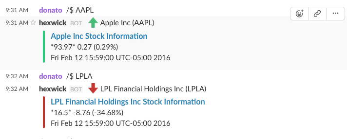

# stockbot

**Description**: Super simple Node.js server for posting Stock prices to any slack channels via a slash commands

Other things to include:

  - **Technology stack**: [Node.js](https://nodejs.org/en/)
  - **Status**:  1.0. Once there are more changes, they will be added to the [CHANGELOG](CHANGELOG.md).

**Screenshot**:

## Dependencies

 - [request](https://www.npmjs.com/package/request) `npm install request`
 - [express](https://www.npmjs.com/package/express) `npm install express`
 - [request](https://www.npmjs.com/package/request) `npm install request`
 - [Node.js](https://nodejs.org/en/download/)

## Installation & Usage

- Installing dependencies: `npm install`
- Run the server: `node app.js`

I also recommend checking out [devdactic's](https://devdactic.com/first-slackbot/) blogpost for help as well.

## Known issues

None

## Getting help

Contact the admins in the hexwick slack channel: http://www.hexwick.com/

## Getting involved

This section should detail why people should get involved and describe key areas you are
currently focusing on; e.g., trying to get feedback on features, fixing certain bugs, building
important pieces, etc.

General instructions on _how_ to contribute should be stated with a link to [CONTRIBUTING](CONTRIBUTING.md).

----

## Open source licensing info
1. [LICENSE](LICENSE)

----

## Credits and references

1. Donato Perconti - @donato
2. Ash Taylor - @ash